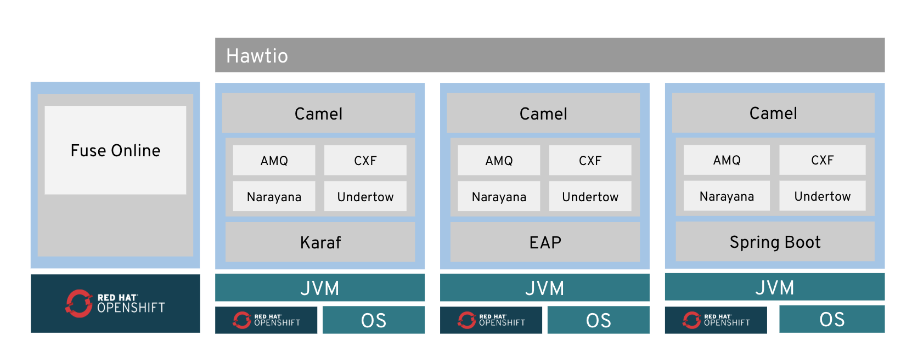
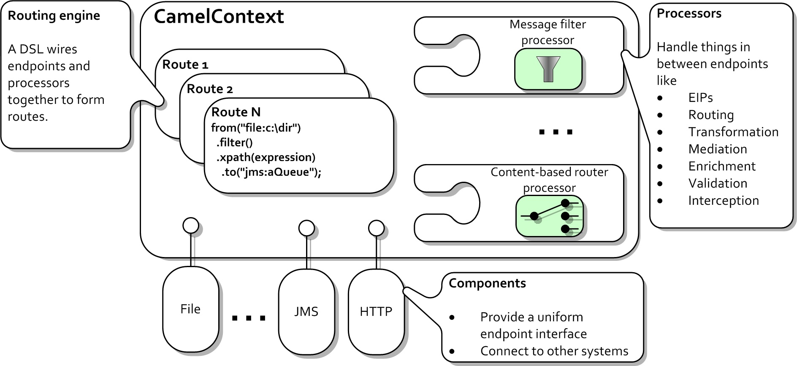
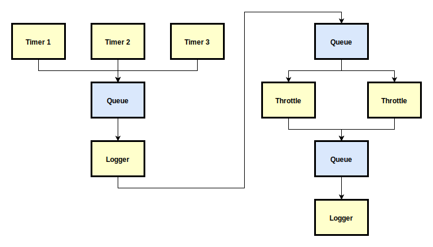
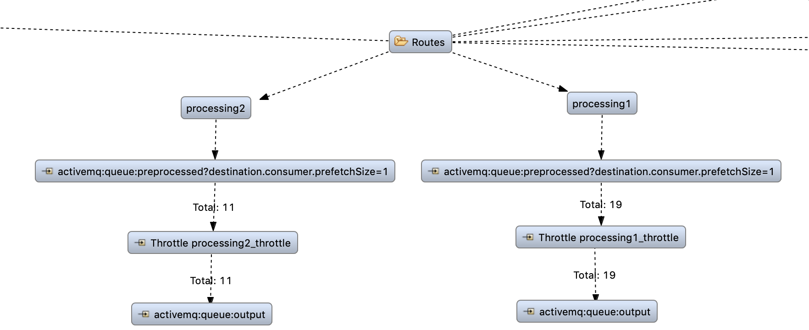
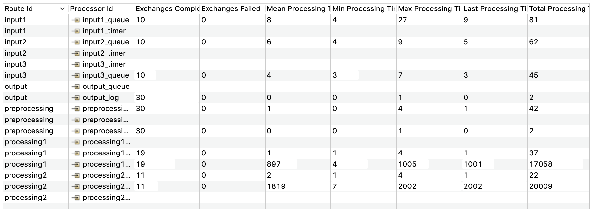
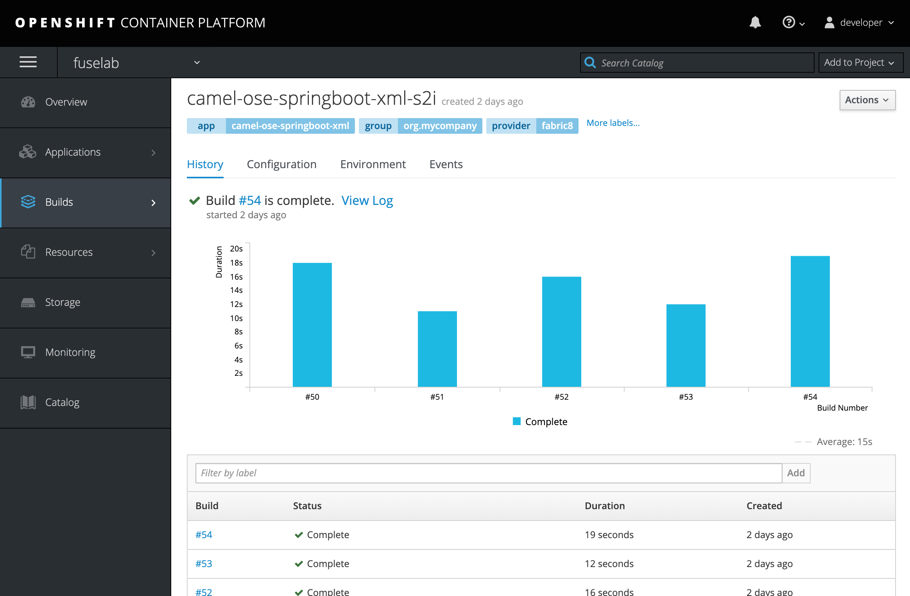

# ActiveMQ in Red Hat Fuse

## Table of Contents

- <a href="#introduction">Introduction</a>
- <a href="#red-hat-fuse">Red Hat Fuse</a>
- <a href="#apache-camel">Apache Camel</a>
- <a href="#sample-application">Sample Application</a>
  - <a href="#prerequisites">Prerequisites</a>
  - <a href="#architecture">Architecture</a>
  - <a href="#implementation">Implementation</a>
  - <a href="#deployment">Deployment</a>
- <a href="#interpretation">Interpretation of the Results</a>

<a id="introduction"></a>
## Introduction

The goal of this project was to show how ActiveMQ can be used in the context of
the Red Hat Fuse integration platform.

For this purpose, a sample application was created that takes input messages
from Fuse's built-in Timer Component and moves them through a series of
"processing" (i.e. logging) steps which are connected by ActiveMQ queues. To
make example a bit more interesting, the input messages are produced by not just
one but multiple timers, and the different processing steps are using different
numbers of consumers with different throughputs as well.

The architecture and implementation of the application are described in more
detail in the <a href="#sample-application">Sample Application</a> section
of this documentation, while the sections before that give a short overview of
the technologies on which the application was built.

<a id="red-hat-fuse"></a>
## Red Hat Fuse

Red Hat Fuse describes itself as a "distributed integration platform [...] that
connects everything from legacy systems and application programming interfaces
(APIs) to partner networks and Internet of Things (IoT) devices" [[1]].

A basic overview of the different technology stacks that Red Hat Fuse uses to
achieve these cross-application integrations and communication is shown in the
image below (taken from the official Red Hat developer website [[2]]):

 

There are certain advantages and disadvantages to the different stacks (see
[[3]] for more information on this). However, the technological differences
aren't really relevant in the context of this project. Here, the Spring Boot
stack was used simply because it is the one that is used by default when
creating a new Fuse Integration Project in the Red Hat Developer Studio / Red
Hat CodeReady Studio IDE [[4]], making it the easiest one to get started with.

A more thorough description of the technologies inside of the stacks is,
unfortunately, beyond the scope of this project. Only Apache Camel, which
revealed itself as the most prominent technology of the whole stack(s) during
the development of this project, has earned its own section below. For more
information about the rest of the technologies, please refer to the Red Hat
Fuse Product Documentation [[5]] or the official websites of the technologies
themselves.

<a id="apache-camel"></a>
## Apache Camel

In their book "Enterprise Integration Patterns" (EIPs) [[6]], Gregor Hohpe and
Bobby Woolf describe a series of patterns that represent proven solutions to
common integration problems. However, as with Design Patterns like Singleton,
Composite and Observer, EIPs like Message, Message Bus and Event-Driven Consumer
still require at least an implementation step before being usable in an actual
code base.

This is where Apache Camel [[7]], which is the main component of Red Hat Fuse's
integration capabilities, comes into play. As Jonathan Anstey, co-author of the
book "Camel in Action" [[8]], puts it [[9]]:
 
>   Apache Camel is an open source Java framework that focuses on making
>   integration easier and more accessible to developers. It does this by
>   providing:
>
>   -   concrete implementations of all the widely used EIPs
>   -   connectivity to a great variety of transports and APIs
>   -   easy to use Domain Specific Languages to wire EIPs and transports
>       together

The image below (taken from [[9]]) shows a high level view of the architecture
that is used by Camel to achieve this:

 

Here, Components are basically the adapters that are performing the mapping
between messages from application APIs or other transports (HTTP, JMS,
ActiveMQ, ...) to the interfaces used by Camel's messaging system. Each
Component (\~ Application) can be accessed through a URI, and different
Components can be connected by defining routing rules. Processors can be
added at any point along a route to perform additional operations on the
messages that are sent across the route.

A "Hello World" implementation based on Camel that simply writes "Hello from
Camel!" to the console every second might look like the following:

```java
import org.apache.camel.builder.RouteBuilder;
import org.springframework.stereotype.Component;

@Component
public class HelloWorldRouteBuilder extends RouteBuilder {
  @Override
  public void configure() {
    from("timer://foo?period=1000")
      .setBody(() -> "Hello from Camel!")
      .log(">>> ${body}");
  }
}
```

Or similarly in XML:

```xml
<?xml version="1.0" encoding="UTF-8"?>
<beans
  xmlns="http://www.springframework.org/schema/beans"
  xmlns:xsi="http://www.w3.org/2001/XMLSchema-instance"
  xsi:schemaLocation="
    http://www.springframework.org/schema/beans
    http://www.springframework.org/schema/beans/spring-beans.xsd
    http://camel.apache.org/schema/spring
    http://camel.apache.org/schema/spring/camel-spring.xsd">
    
  <camelContext xmlns="http://camel.apache.org/schema/spring">
    <route>
      <from uri="timer://foo?period=1000"/>
      <setBody>
        <simple>Hello from Camel!</simple>
      </setBody>
      <log message=">>> ${body}"/>
    </route>
  </camelContext>
  
</beans>
```

Of course, much more elaborate routes can be defined as well. For example,
routes could contain conditional routing logic that changes the routing path
depending on the content of certain headers or the body of the message. Routes
could also contain multiple processing and transformation steps that might be
implemented as Beans or even standalone applications which are accessed through
a custom Component. Outputs could then not just be written to the console, but
to files or databases, or sent via e-mail or other communication protocols.

More information about Camel and its use in Red Hat Fuse is available on the
official Camel website [[9]] and Red Hat's Apache Camel Development Guide in
the Red Hat Fuse Product Documentation [[10]].

<a id="sample-application"></a>
## Sample Application

<a id="prerequisites"></a>
### Prerequisites

To run the sample application on a development machine, a JDK version >= 8 and
Maven version >= 3.3 are needed.

In addition to that, use of the Red Hat Developer Studio / Red Hat CodeReady
Studio IDE [[4]] is encouraged by Red Hat in pretty much all of the tutorials
that I read through (see, for example, the Hello World guide [[11]]). I don't
think that this is a strict requirement, since for local execution, no Fuse /
OpenShift specific functionality is needed anyway, but use of the IDE might be
worth it for the convenience features (such as visual Camel route editing and
project templates) that the IDE, which is based on Eclipse, provides over
standard Eclipse or other IDEs.

To test the application on an OpenShift [[12]] instance, the Red Hat Container
Development Kit (CDK) [[13]], which provides a single-node OpenShift cluster
inside a VM, can be used. Full installation instructions for the CDK can be
found on the Red Hat website [[14]].

<a id="architecture"></a>
### Architecture

As described in the <a href="#introduction">Introduction</a> section of this
project, the sample application is supposed to take input messages from multiple
instances of the built-in Timer Component and move them through a series of
"processing" steps which are connected by ActiveMQ queues.

The concrete message flows that should be implemented for this by the
application are shown schematically in the image below:

 

Each timer should produce a total of 10 messages at a rate of 1 message per
second. Loggers should have "unlimited" throughput, and Throttles should have
throughputs of 1 message per second and 1 messages per 2 seconds, respectively.
This causes a build-up of messages in the second queue while the Timers are
producing, which will be dealt with once the Timers have stopped producing.

To "visualize" the different speeds of message production by the Timers vs.
message consumption by the Throttles, the Loggers should print throughput
information about the messages that reach them to console.

<a id="implementation"></a>
### Implementation

The sample application only uses the built-in Timer [[18]], ActiveMQ [[19]] and
Log [[20]] Components as well as a Throttle [[21]] Processor.

To clarify the bits of EIP / Camel terminology:

-   Components are factories for Message Endpoints [[22]],
-   Message Endpoints are producers of messages [[23]] and
-   Processors are either consumers or Message Translators [[24]].

Since only built-in components / processors are used, implementation of the
described architecture is just a matter of defining the correct routes between
them. As described in the <a href="#apache-camel">Apache Camel</a> section, this
can done in either XML:

```xml
<route>
    <from uri="timer:timer?repeatCount=10"/>
    <to uri="activemq:queue:input"/>
</route>
<route>
    <from uri="timer:timer?repeatCount=10"/>
    <to uri="activemq:queue:input"/>
</route>
<route>
    <from uri="timer:timer?repeatCount=10"/>
    <to uri="activemq:queue:input"/>
</route>

<route>
    <from uri="activemq:queue:input"/>
    <to uri="log:preprocessing?groupInterval=1000&amp;groupDelay=1000"/>
    <to uri="activemq:queue:preprocessed"/>
</route>

<route>
    <from uri="activemq:queue:preprocessed?destination.consumer.prefetchSize=1"/>
    <throttle timePeriodMillis="1000">
        <constant>1</constant>
        <to uri="activemq:queue:output"/>
    </throttle>
</route>
<route>
    <from uri="activemq:queue:preprocessed?destination.consumer.prefetchSize=1"/>
    <throttle timePeriodMillis="2000">
        <constant>1</constant>
        <to uri="activemq:queue:output"/>
    </throttle>
</route>

<route id="output">
    <from uri="activemq:queue:output"/>
    <to uri="log:output?groupInterval=1000&amp;groupDelay=1000"/>
</route>
```

or Java:

```java
from("timer:timer?repeatCount=10").to("activemq:queue:input");
from("timer:timer?repeatCount=10").to("activemq:queue:input");
from("timer:timer?repeatCount=10").to("activemq:queue:input");

from("activemq:queue:input")
    .to("log:preprocessing?groupInterval=1000&groupDelay=1000")
    .to("activemq:queue:preprocessed");

from("activemq:queue:preprocessed?destination.consumer.prefetchSize=1")
    .throttle(1).timePeriodMillis(1000)
    .to("activemq:queue:output");
from("activemq:queue:preprocessed?destination.consumer.prefetchSize=1")
    .throttle(1).timePeriodMillis(2000)
    .to("activemq:queue:output");

from("activemq:queue:output")
    .to("log:output?groupInterval=1000&;groupDelay=1000");
```

When `Run As -> Local Camel Context`, the application then produces output
similar to the following:

```text
18:40:10.062 [Camel (MyCamel) thread #3 - ThroughputLogger] INFO  preprocessing - Received: 3 new messages, with total 3 so far. Last group took: 362 millis which is: 8.287 messages per second. average: 8.287
18:40:10.102 [Camel (MyCamel) thread #4 - ThroughputLogger] INFO  output - Received: 2 new messages, with total 2 so far. Last group took: 387 millis which is: 5.168 messages per second. average: 5.168
18:40:11.057 [Camel (MyCamel) thread #3 - ThroughputLogger] INFO  preprocessing - Received: 3 new messages, with total 6 so far. Last group took: 999 millis which is: 3.003 messages per second. average: 4.409
18:40:11.102 [Camel (MyCamel) thread #4 - ThroughputLogger] INFO  output - Received: 1 new messages, with total 3 so far. Last group took: 1000 millis which is: 1 messages per second. average: 2.163
18:40:12.057 [Camel (MyCamel) thread #3 - ThroughputLogger] INFO  preprocessing - Received: 3 new messages, with total 9 so far. Last group took: 1000 millis which is: 3 messages per second. average: 3.812
18:40:12.102 [Camel (MyCamel) thread #4 - ThroughputLogger] INFO  output - Received: 2 new messages, with total 5 so far. Last group took: 1000 millis which is: 2 messages per second. average: 2.095
18:40:13.058 [Camel (MyCamel) thread #3 - ThroughputLogger] INFO  preprocessing - Received: 3 new messages, with total 12 so far. Last group took: 1001 millis which is: 2.997 messages per second. average: 3.569
18:40:13.101 [Camel (MyCamel) thread #4 - ThroughputLogger] INFO  output - Received: 1 new messages, with total 6 so far. Last group took: 999 millis which is: 1.001 messages per second. average: 1.772
18:40:14.057 [Camel (MyCamel) thread #3 - ThroughputLogger] INFO  preprocessing - Received: 3 new messages, with total 15 so far. Last group took: 999 millis which is: 3.003 messages per second. average: 3.44
18:40:14.101 [Camel (MyCamel) thread #4 - ThroughputLogger] INFO  output - Received: 2 new messages, with total 8 so far. Last group took: 1000 millis which is: 2 messages per second. average: 1.824
18:40:15.058 [Camel (MyCamel) thread #3 - ThroughputLogger] INFO  preprocessing - Received: 3 new messages, with total 18 so far. Last group took: 1001 millis which is: 2.997 messages per second. average: 3.357
18:40:15.101 [Camel (MyCamel) thread #4 - ThroughputLogger] INFO  output - Received: 1 new messages, with total 9 so far. Last group took: 1000 millis which is: 1 messages per second. average: 1.671
18:40:16.058 [Camel (MyCamel) thread #3 - ThroughputLogger] INFO  preprocessing - Received: 3 new messages, with total 21 so far. Last group took: 1000 millis which is: 3 messages per second. average: 3.301
18:40:16.101 [Camel (MyCamel) thread #4 - ThroughputLogger] INFO  output - Received: 2 new messages, with total 11 so far. Last group took: 1000 millis which is: 2 messages per second. average: 1.723
18:40:17.059 [Camel (MyCamel) thread #3 - ThroughputLogger] INFO  preprocessing - Received: 3 new messages, with total 24 so far. Last group took: 1001 millis which is: 2.997 messages per second. average: 3.26
18:40:17.102 [Camel (MyCamel) thread #4 - ThroughputLogger] INFO  output - Received: 1 new messages, with total 12 so far. Last group took: 1001 millis which is: 0.999 messages per second. average: 1.624
18:40:18.058 [Camel (MyCamel) thread #3 - ThroughputLogger] INFO  preprocessing - Received: 3 new messages, with total 27 so far. Last group took: 999 millis which is: 3.003 messages per second. average: 3.229
18:40:18.102 [Camel (MyCamel) thread #4 - ThroughputLogger] INFO  output - Received: 2 new messages, with total 14 so far. Last group took: 1000 millis which is: 2 messages per second. average: 1.669
18:40:19.057 [Camel (MyCamel) thread #3 - ThroughputLogger] INFO  preprocessing - Received: 3 new messages, with total 30 so far. Last group took: 999 millis which is: 3.003 messages per second. average: 3.205
18:40:19.101 [Camel (MyCamel) thread #4 - ThroughputLogger] INFO  output - Received: 1 new messages, with total 15 so far. Last group took: 999 millis which is: 1.001 messages per second. average: 1.598
18:40:20.101 [Camel (MyCamel) thread #4 - ThroughputLogger] INFO  output - Received: 2 new messages, with total 17 so far. Last group took: 1000 millis which is: 2 messages per second. average: 1.637
18:40:21.101 [Camel (MyCamel) thread #4 - ThroughputLogger] INFO  output - Received: 1 new messages, with total 18 so far. Last group took: 1000 millis which is: 1 messages per second. average: 1.581
18:40:22.102 [Camel (MyCamel) thread #4 - ThroughputLogger] INFO  output - Received: 2 new messages, with total 20 so far. Last group took: 1001 millis which is: 1.998 messages per second. average: 1.615
18:40:23.101 [Camel (MyCamel) thread #4 - ThroughputLogger] INFO  output - Received: 1 new messages, with total 21 so far. Last group took: 999 millis which is: 1.001 messages per second. average: 1.569
18:40:24.102 [Camel (MyCamel) thread #4 - ThroughputLogger] INFO  output - Received: 2 new messages, with total 23 so far. Last group took: 1001 millis which is: 1.998 messages per second. average: 1.599
18:40:25.101 [Camel (MyCamel) thread #4 - ThroughputLogger] INFO  output - Received: 1 new messages, with total 24 so far. Last group took: 999 millis which is: 1.001 messages per second. average: 1.56
18:40:26.101 [Camel (MyCamel) thread #4 - ThroughputLogger] INFO  output - Received: 2 new messages, with total 26 so far. Last group took: 1000 millis which is: 2 messages per second. average: 1.587
18:40:27.101 [Camel (MyCamel) thread #4 - ThroughputLogger] INFO  output - Received: 1 new messages, with total 27 so far. Last group took: 1000 millis which is: 1 messages per second. average: 1.553
18:40:28.101 [Camel (MyCamel) thread #4 - ThroughputLogger] INFO  output - Received: 2 new messages, with total 29 so far. Last group took: 1000 millis which is: 2 messages per second. average: 1.577
18:40:30.101 [Camel (MyCamel) thread #4 - ThroughputLogger] INFO  output - Received: 1 new messages, with total 30 so far. Last group took: 2000 millis which is: 0.5 messages per second. average: 1.472
```

This output shows that the timers really are producing messages at a cumulative
rate of 3 messages per second, while enforced throttling prevents the
application from processing more than 1.5 messages per second.

While the different processing speeds of the two throttles are already somewhat
apparent from this log (2 messages processed every even second, 1 message
processed every odd second), an even better overview can be gained through
tracing, either as a graphical representation:



or in a tabular format:



For automated testing, Camel also provides different testing endpoints like
DataSet, Mock and Test, as well as functionalities to stub physical transport
technologies [[25]], though none of those were used in this project.

Custom Endpoints, Processors etc. can be created by implementing the
corresponding interfaces (`Endpoint`, `Processor`, ...) [[24]], and can then be
referred to by their Bean IDs (e.g. `from("myProcessor").to(...)`).

Any Bean or POJO can also be referred to in routes through the bean [[26]] and
class [[27]] components (e.g. `from(...).to("bean:Foo?method=bar")` or
`from(...).to("class:com.example.Foo?method=bar")`). However, when these
components are used, the classes cannot function as the input for a route
and Camel will only pass them the body of any incoming messages (i.e. no header
information), which limits the potential use cases for such a solution.

<a id="deployment"></a>
### Deployment

Deployment to OpenShift works through a fabric8 [[15]] plugin [[16]] for maven,
making deployment as simple as running `maven install fabric8:deploy`.

At least for the sample application, the only information that had to be
manually configured to enable the plugin to do its work were the IP address
of the OpenShift instance and the authentication information that was necessary
to access the instance. With this information provided, the plugin automatically
generates the necessary OpenShift resource descriptors and pushes all the files
that OpenShift needs to the OpenShift instance.

OpenShift then takes this information to build a Docker image from the
application and deploys the resulting image as a pod on the underlying
Kubernetes cluster. During this process, OpenShift ensures that high
availability of the services provided by the application is maintained by
keeping the old version running until the new version has successfully been
started.

The status of builds and running applications can be monitored through the
OpenShift Web Console [[17]]. A screenshot of the Web Console showing an
overview of several builds of the sample application can be seen below: 

 

<a id="interpretation"></a>
## Interpretation of the Results

A rather large portion of the total "development" time of the project was spent
for the initial setup of the development environment and a lot of reading and
searching in the very extensive Product Documentation for Red Hat Fuse [[27]]
to find the bits of information that would be relevant for the implementation
of the sample application.

In hindsight, this process could've probably been streamlined and shortened 
considerably by using the "Tooling Tutorials" [[28]] from the Product
Documentation as the entry point for getting started with Red Hat Fuse. Although
I only came across this tutorial more or less by accident after having finished
pretty much all of the implementation already (after all, it is "hidden away"
in the "Tooling" section of the product documentation, which, at first glance,
seeemed rather uninteresting to me compared to the "Development" section), it
is by far the best Red Hat Fuse tutorial that I have found so far. Apart from
the very basics, it has information about debugging, tracing, unit testing
(i.e. "tooling", i guess ;)) and, perhaps most importantly, how to run an
application without any standalone Fuse or OpenShift server, which would've
made for a much shorter ramp-up time and more convenient development overall
due to reduced deployment times.

The other relevation the hit me only after I had worked on the project for quite
a while already was that many of the things that you are interacting with as
a developer when using Fuse really are just the frameworks that Fuse as a
platform is build from. For Apache Camel, this became especially apparent to me
when I looked on the  Camel website and discovered pretty much a 1:1 copy of
what I had seen on the Camel parts of the Fuse documentation before (see, for
example, [[18]] and [[29]]).

Looking through the notes I made during development, the only things I have
written down as negatives are the "slow setup process", "slow deployments" and
"Eclipse" (which the Red Hat Developer Studio IDE is based on). Since the first
two points turned out to be avoidable by not using OpenShift during development
(or at least not right away), and arguing about Eclipse is pretty hopeless in
any case, I guess it's safe to say that, overall, I'm pretty happy with Fuse.
At least as far as I can tell from my, admittedly, rather limited experience
with it, which turned out to be more of a "Camel + Web Console" kind of affair
than I had initially anticipated.

The positives from my notes basically boil down to "Camel seems pretty nice
and has many Connectors to existing applications, including some applications
that I'm actually using" and "the Red Hat documentation is really well-written
and really, really extensive, to the point where I wouldn't be surprised if a
copy of every single documentation that you can find was in there somewhere".
I also seemed to like the visual editor for Camel routes in the Red Hat
Developer IDE, but can't really agree with my past-self on this point anymore,
so I'll mark this one down as a tie.

TLDR: When starting out with Fuse, do the "Tooling Tutorials" [[28]] first.
After that, you'll be well-equipped to find everything else you need in the
well-written and very extensive Product Documentation for Red Hat Fuse [[5]].

[1]: https://www.redhat.com/en/resources/red-hat-fuse-cloud-native-distributed-integration
[2]: https://developers.redhat.com/products/fuse/overview/
[3]: https://access.redhat.com/documentation/en-us/red_hat_fuse/7.2/html/getting_started/getstarted-dashboard
[4]: https://developers.redhat.com/products/codeready-studio/overview/
[5]: https://access.redhat.com/documentation/en-us/red_hat_fuse/7.2/
[6]: https://www.enterpriseintegrationpatterns.com/
[7]: https://camel.apache.org/
[8]: https://www.manning.com/books/camel-in-action-second-edition
[9]: https://dzone.com/articles/open-source-integration-apache
[10]: https://access.redhat.com/documentation/en-us/red_hat_fuse/7.2/html/apache_camel_development_guide/index
[11]: https://developers.redhat.com/products/fuse/hello-world
[12]: https://www.openshift.com/
[13]: https://developers.redhat.com/products/cdk/overview/
[14]: https://developers.redhat.com/products/cdk/hello-world/
[15]: http://fabric8.io/
[16]: https://maven.fabric8.io/
[17]: https://docs.openshift.com/container-platform/3.11/architecture/infrastructure_components/web_console.html
[18]: https://access.redhat.com/documentation/en-us/red_hat_fuse/7.2/html/apache_camel_component_reference/timer-component
[19]: https://access.redhat.com/documentation/en-us/red_hat_fuse/7.2/html/apache_camel_component_reference/idu-activemq
[20]: https://access.redhat.com/documentation/en-us/red_hat_fuse/7.2/html/apache_camel_component_reference/log-component
[21]: https://access.redhat.com/documentation/en-us/red_hat_jboss_fuse/6.3/html/apache_camel_development_guide/msgrout-throttler
[22]: https://camel.apache.org/component.html
[23]: https://camel.apache.org/message-endpoint.html
[24]: https://camel.apache.org/processor.html
[25]: https://camel.apache.org/testing.html
[26]: https://access.redhat.com/documentation/en-us/red_hat_fuse/7.2/html/apache_camel_component_reference/bean-component
[27]: https://access.redhat.com/documentation/en-us/red_hat_fuse/7.2/html/apache_camel_component_reference/class-component
[28]: https://access.redhat.com/documentation/en-us/red_hat_fuse/7.2/html/tooling_tutorials/index
[29]: https://camel.apache.org/timer.html
